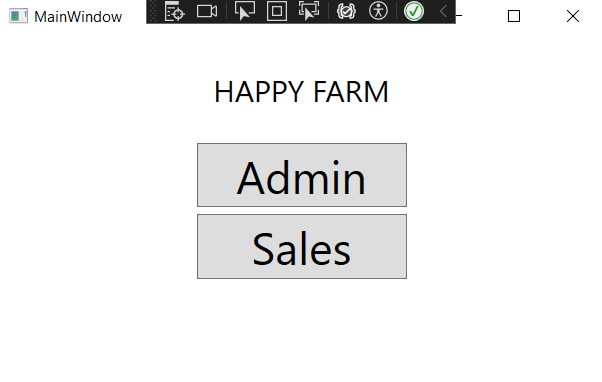
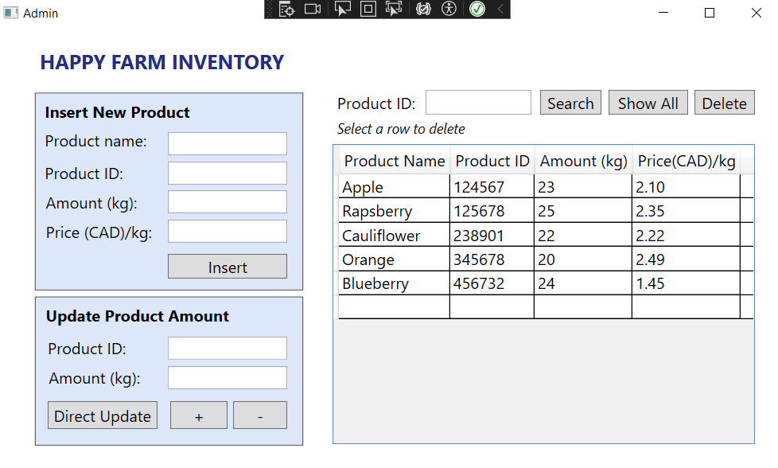
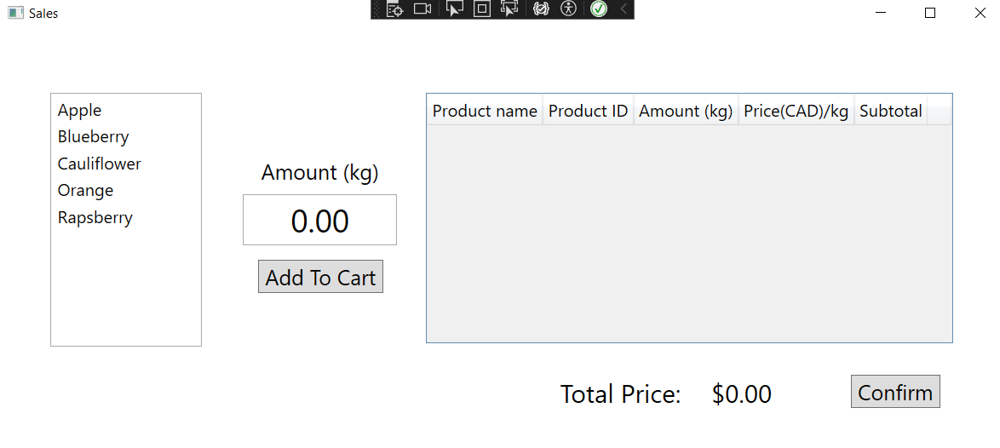

# DesktopDevEQ3Assign1

# FarmInventory

FarmInventory is a Windows desktop application that helps manage the inventory and sales of products in a farm. It provides features for adding new products, updating product quantities, and making sales.

## Getting Started

To run the application, follow these steps:

1. Clone the repository or download the source code.
2. Open the solution in Visual Studio.
3. Build the solution to restore NuGet packages and compile the project.
4. Set the `FarmInventory` project as the startup project.
5. Run the application.

## Project Structure

The project consists of the following files:

- `Product.cs`: Defines the `Product` class representing a farm product. It contains properties for the product's name, ID, amount, and price.
- `CartItem.cs`: Defines the `CartItem` class representing an item in the customer's cart. It contains properties for the product name, ID, amount purchased, price per kg, and subtotal.
- `AdminController.cs`: Contains the `AdminController` class responsible for handling operations related to the admin functionality. It includes methods for inserting new products, retrieving all products, searching for products by ID, deleting products, and updating product quantities.
- `SalesController.cs`: Contains the `SalesController` class responsible for handling operations related to the sales functionality. It includes methods for calculating subtotals and the final total price of cart items, retrieving products from the database, adding cart items, and getting cart items.
- `MainWindow.xaml.cs`: Contains the code-behind logic for the main window of the application. It handles button click events for the "Admin" and "Sales" buttons, opening the corresponding windows.
- `MainWindow.xaml`: Defines the XAML markup for the main window UI, including buttons and labels.
- `Admin.xaml.cs`: Contains the code-behind logic for the Admin.xaml user interface. It handles the event handling and interaction with the admin-related functionality.
- `Admin.xaml`: This XAML file defines the visual layout and design for the admin interface. It specifies the user interface controls, layout containers, and bindings to display and manage the admin-related features.
- `Sales.xaml.cs`: The Sales.xaml.cs file contains the code-behind logic for the Sales.xaml user interface. It handles the event handling and interaction with the sales-related functionality.
- `Sales.xaml`: This XAML file defines the visual layout and design for the sales interface. It specifies the user interface controls, layout containers, and bindings to display and manage the sales-related features.

## Dependencies

The project has the following dependencies:

- Npgsql: A .NET data provider for PostgreSQL. It is used for connecting to the PostgreSQL database and executing queries.

## Images

||
|:--:|
|Figure 1: MainWindow|

||
|:--:|
|Figure 2: Admin window|

||
|:--:|
|Figure 3: Sales window|
